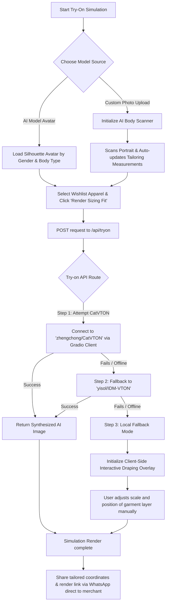

# Vendorlize: Phasion Sense

Vendorlize is a luxury bespoke virtual try-on studio and digital catalog interface designed for local merchants. It enables customers to scan their silhouettes, simulate virtual try-ons, and place direct customized orders with merchants.

---

## 🚀 How to Run the Code Locally

You can run the application locally in just a few steps. **No API keys or external configurations are required** to test or use the full suite of features!

### 📋 Prerequisites
Ensure you have the following installed on your machine:
- [Node.js](https://nodejs.org/) (v18 or higher recommended)
- [npm](https://www.npmjs.com/) (installed automatically with Node.js)

### ⚙️ Installation & Setup

1. **Clone or navigate to the repository directory:**
   ```bash
   cd vendorlize
   ```

2. **Install the dependencies:**
   ```bash
   npm install
   ```

3. **Start the development server:**
   ```bash
   npm run dev
   ```

4. **Open the application:**
   Open your browser and navigate to [http://localhost:3000](http://localhost:3000) to view the application in action.

---

## 🔌 Why No API Setup is Needed

The project is designed to run completely out-of-the-box:
- **Pre-configured Environment**: The application utilizes pre-defined sandbox parameters. If an `.env` file exists, it will use the default credentials. Otherwise, the app operates gracefully without them.
- **Resilient Fallback Design**: If the external Hugging Face AI endpoints are unreachable, rate-limited, or run without tokens, the app automatically switches to **Interactive Draping Overlay Mode**. This ensures that the user experience is never blocked.

---

## 🎨 How the Try-On Feature Works

The **Clothify Studio Try-On** feature allows customers to visualize garments on physical silhouettes using a dual-mode engine:



### 1. The Processing Pipeline
- **AI Body Scanner**: When a user uploads a portrait, a simulated scanner estimates body dimensions (Chest, Waist, Hips, Height, Inseam) based on alignment joints, writing tailored metrics directly to the user's local context.
- **Route Handler (`/api/tryon`)**: The frontend calls this Next.js API route with a person's image and a garment image.
- **Hugging Face Gradio Client**:
  - **CatVTON**: The route first attempts to connect to `zhengchong/CatVTON` using the lightweight `@gradio/client` API wrapper to run diffusion-based virtual try-on inference.
  - **IDM-VTON**: If CatVTON fails or times out, the system falls back to `yisol/IDM-VTON` to try matching the clothing item to the user's pose.

### 2. The Client-Side Fallback (Interactive Draping)
If both AI models are offline or return an error, the studio recovers gracefully:
- It launches **Interactive Draping Mode** directly in the browser.
- The garment is rendered as a transparent, high-quality layer overlaying the target silhouette.
- The user can **drag to position** the garment and use a **precision slider** to scale the garment up/down to visually inspect the size fit.

### 3. Tailored Merchant Checkout
Once the simulation is complete, the user can click **Share Fit**. This automatically compiles the custom tailoring coordinates (from their profile) and the try-on simulation link into a custom template and launches a pre-configured **WhatsApp message** directly to the merchant to place a bespoke order.
